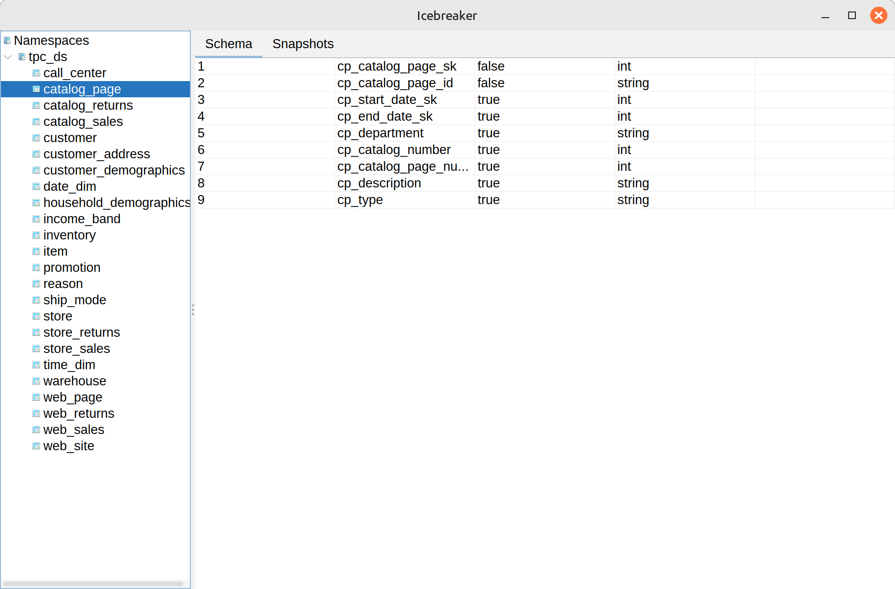
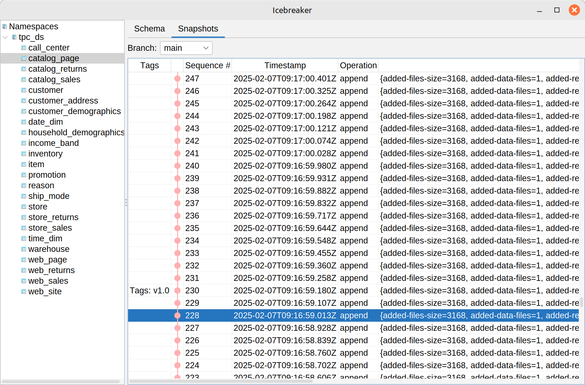

# Icebreaker

A GUI for Apache Iceberg REST Catalog.

In development.




See [dev/](dev/) for creating a developer catalog.

To run:
```shell
./gradlew run --args "http://localhost:8181"
```

# License

The code is licensed under Apache License 2.0, see [LICENSE](LICENSE).

The icons are from [Bootstrap Icons](https://icons.getbootstrap.com/).
